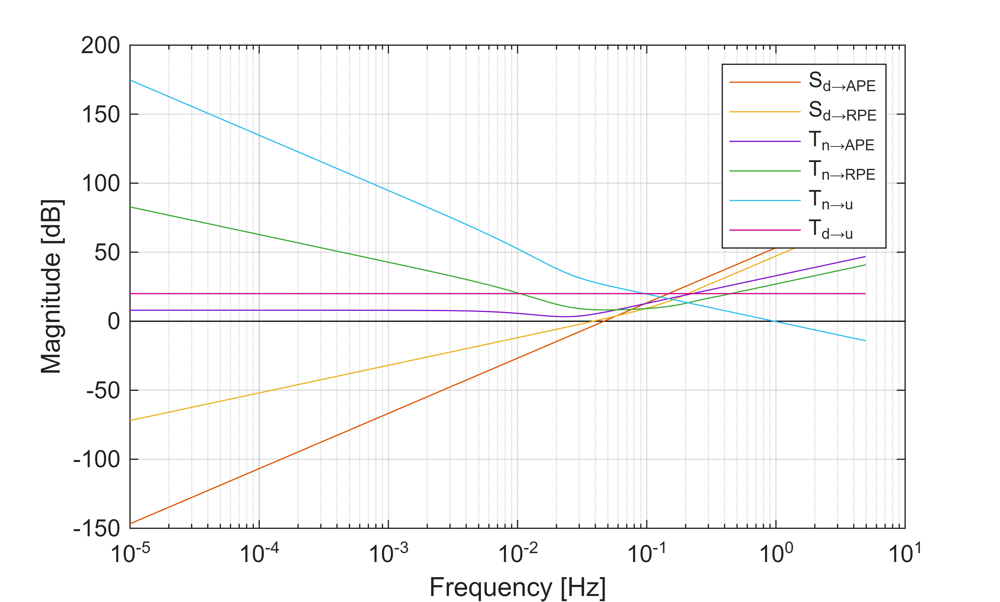
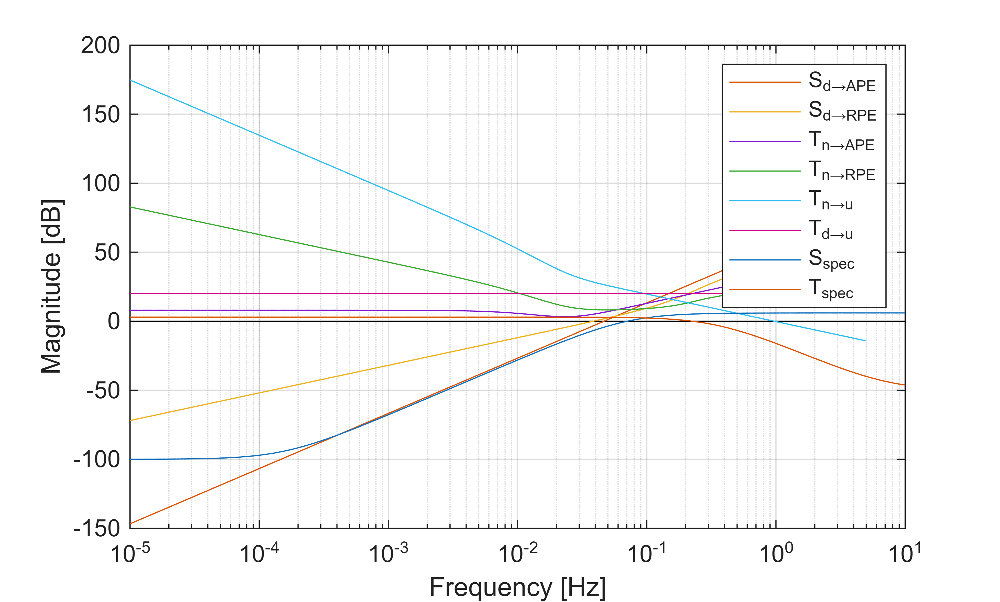
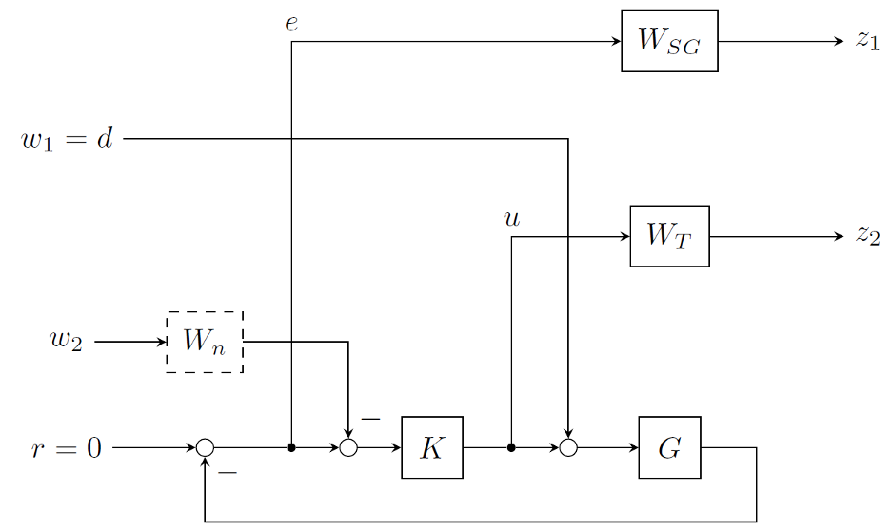
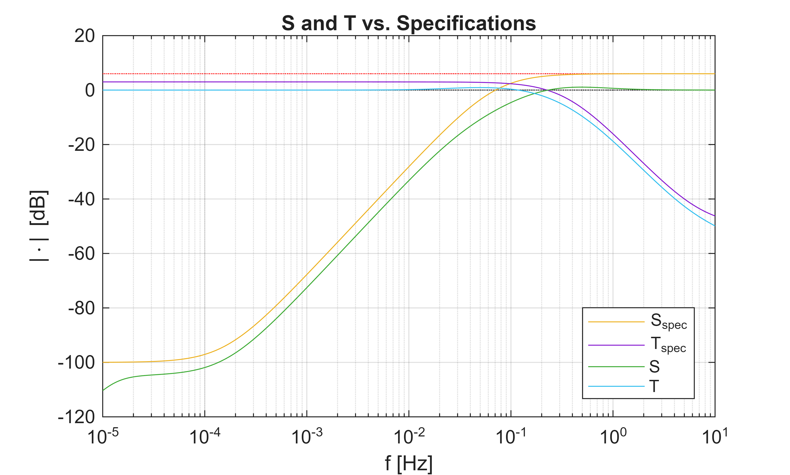
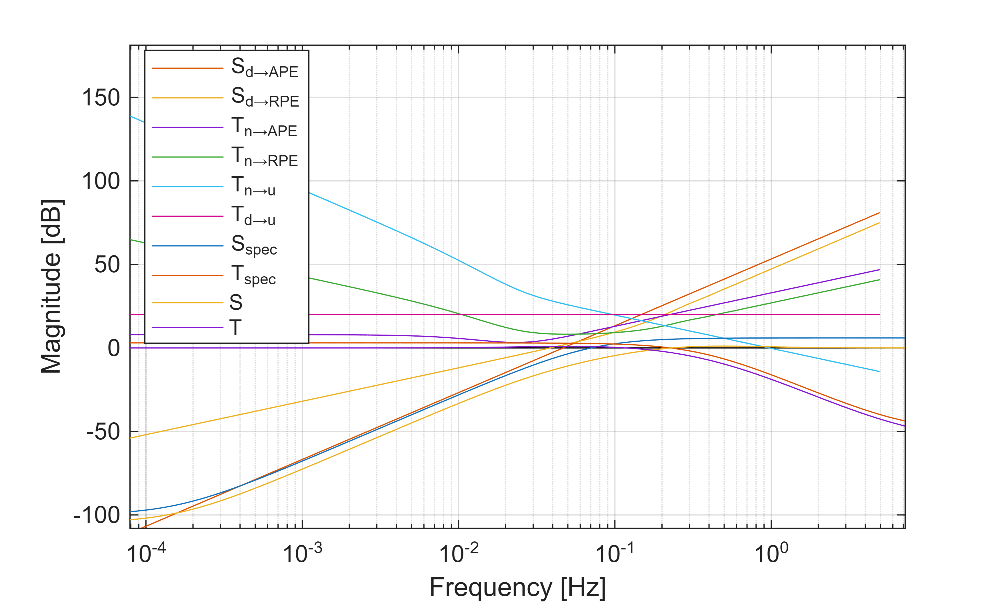
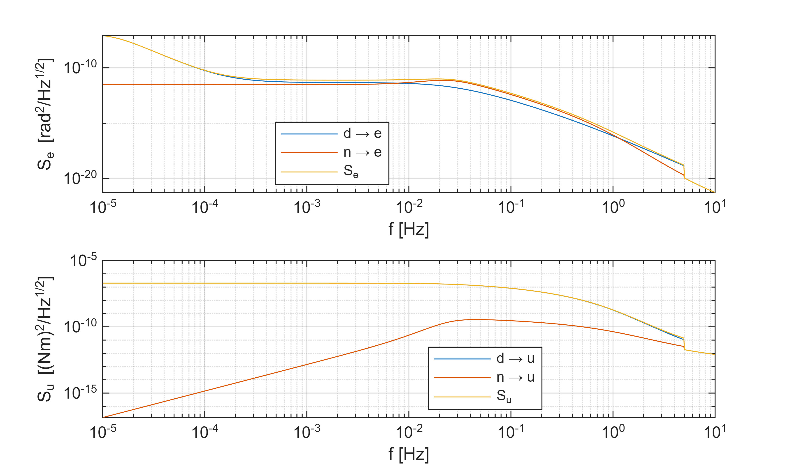

# Exercise: Pointing Controller Synthesis

A single\-axis pointing controller shall be synthesized for the following plant, sensors, and requirements:

-  The plant consists of the rigid body dynamics: $\ddot{\;\phi } =J^{-1} \;\tau \;$ with state $x^{\top \;} =\left\lbrack \phi \;\;\dot{\;\phi \;} \right\rbrack$, output $y=\phi \;$, and input $u=\tau \;$. 
-  The spacecraft's inertia matrix is given by $J=\textrm{diag}\left\lbrace 1200\;,1500\;,500\right\rbrace {\textrm{kgm}}^2$. 
-  The actuator noise is a BLWN with $\sigma_d =1\textrm{mNm}$ and sampling time 0.1s. 
-  The attitude is estimated with a GSE using a JOP Astro APS 3 star tracker and Astrix 120 gyroscope. 
-  The STR noise can be modelled as BLWN with ${3\sigma }_{\textrm{STR}} =2\ldotp 4\;\arcsec$ and sampling time 0.1s. 
-  The gyro noise can be modelled with the angular random walk coefficient $0\ldotp 0016\frac{\deg }{\sqrt{\;\textrm{Hz}}}$ ( $1\sigma$ ) and flicker rate coefficient 0.01 deg/h ( $3\sigma$ ). 
-  Assume a fusion frequency of 0.04 Hz and a damping of $\frac{\sqrt{\;2}}{2}$ for the GSE. 
-  The APE requirement is $\sigma_{\textrm{att},\textrm{ABS}} =2\;\arcsec$. 
-  The RPE requirement over a 5s time window $\sigma {\;}_{\textrm{att},\textrm{WV}} =1\;\arcsec$. 
-  Noise and disturbances shall cause a maximum control effort "jitter" 0.01 Nm: $\sigma_{u,\textrm{ABS}} =0\ldotp 01\;\textrm{Nm}$. 
# Settings, Switches, etc.
```matlab
clear
clc
close all
addpath('auxFcts/');

swAx = 1;    % 1: x-axis, 2: y-axis, 3: z-axis

fVec = logspace(-5,1,1001)'; % [Hz]    Frequency grid to evaluate frequency responses
fUnit = 'Hz'; % Unit of frequency grid
fMax = 5;    % [Hz] maximal relevant frequency (must be consistent with STR, RW noise!)

swSen = 'GSE';    % 'STR' to use only star trackers; 'GSE' to use a gyro-stellar estimator
strDcm_UB = eye(3); % Alignment of STR wrt body frame
fFusion = 0.04;    % [Hz] GSE fusion frequency

s = tf('s');    % Define s as the Laplace variable (useful for the filters later)
```

**Remark:** Feel free to play around with the switches and parameters. However, I suggest to comment out the original values in order to recover them later. Also, the comments and interpretations later in this script may not match what you see after changing some parameters.

# Define the Plant Model as Double integrator

The spacecraft's properties and requirements are stored in the function "loadScParams". Calling it loads them into the structure arrays SC, SEN, ACT, and REQ for the spacecraft properties, sensor properties, actuator properties, and requirements.

```matlab
[SC,SEN,ACT,REQ] = loadScParams();
```

The plant is set up as a state\-space model (ss object) for the 3\-axis rotational dynamics:

 $$ \dot{x} =\left(\begin{array}{c} \dot{\varphi} \newline \ddot{\varphi}  \end{array}\right)=\left\lbrack \begin{array}{cc} 0 & I\newline 0 & 0 \end{array}\right\rbrack \left(\begin{array}{c} \varphi \newline \dot{\varphi}  \end{array}\right)+\left\lbrack \begin{array}{c} 0\newline J^{-1}  \end{array}\right\rbrack \,\tau $$ 

 $$ y=\varphi =\left\lbrack \begin{array}{cc} I & 0 \end{array}\right\rbrack \,x $$ 
```matlab

A = [zeros(3), eye(3); zeros(3,6)];  %    **
B = [zeros(3); inv(SC.J)];  %    **
C = [eye(3), zeros(3)];  %    **
D = zeros(3);  %    **

plant = ss(A,B,C,D,'StateName',{'phi' 'theta' 'psi' 'phiDot' 'thetaDot' 'psiDot'},'InputName',{'trq_x' 'trq_y' 'trq_z'},'OutputName',{'phi','theta','psi'});
```

Next, we select one axis and reduce the plant model with sminreal. 


**Note:** MATLAB's "minreal" function could also be used and in some cases, it is able to delete more states that sminreal. However, sminreal retains the original states, whereas the ss object obtained from minreal has different states.

```matlab
G = sminreal(plant(swAx,swAx))
```

```matlabTextOutput
G =
 
  A = 
              phi  phiDot
   phi          0       1
   phiDot       0       0
 
  B = 
               trq_x
   phi             0
   phiDot  0.0008333
 
  C = 
           phi  phiDot
   phi       1       0
 
  D = 
        trq_x
   phi      0
 
Continuous-time state-space model.
Model Properties
```

# Compute Noise PSDs
-  SEN Noise: STR or GSE? 
-  Directly provide $W_n (s)$ for both STR and GSE? 
-  Assumption for RW torque noise (white noise \-> $W_d (s)$ ) 
-  Formulate error requirements as white noise PSD 

In the following, the STR's standard deviations are transformed into the body frame and the value along the spacecraft's axis of interest is selected. We assume that the STR is aligned with the body frame, i.e. its boresight axis points along the spacecraft's z\-axis. Therefore, we have the cross\-boresight STR performance along the spacecraft's x\- and y\-axis.

```matlab
% Sensor noise
strStd_B = strDcm_UB'*SEN.strStd_U;
strStd = strStd_B(swAx);
```

The STR noise is modelled as band\-limited white noise with sampling time $\Delta \;t$:

 $$ S_{\mathrm{BLWN}} (f)=\left\lbrace \begin{array}{ll} 2\,\sigma^2 \,\Delta t & f\le 1/(2\,\Delta t)\newline 0 & f>1/(2\,\Delta t) \end{array}\right. $$ 
```matlab
strPsd = zeros(size(fVec));
strPsd(fVec<1/(2*SEN.strDt)) = 2*strStd^2*SEN.strDt;
```

If only the STR is used, then the measurement noise PSD equals the STR noise PSD.

```matlab
switch swSen
    case 'STR'
        Sn = strPsd;
    case 'GSE'
        % Gyro Noise
```

If we use a GSE, we have to model the gyro noise as well. We assume that it consists of angular random walk (ARW) and flicker noise. The ARW is simply a white noise on the angular rate, whereas the flicker noise's PSD follows a 1/f profile:

 $$ S_{\mathrm{gyro}} (f)=N_{\mathrm{ARW}}^2 +\frac{N_{\mathrm{FR}}^2 }{2\pi f} $$ 
```matlab
        gyroArwRatePsd = SEN.gyroArwCoeff^2 * ones(size(fVec));
        gyroFlickerRatePsd = SEN.gyroFlickerCoeff^2 ./ (2*pi*fVec);

        gyroRatePsd = gyroArwRatePsd + gyroFlickerRatePsd;
```

The gyro's noise PSD has to be integrated once such that it corresponds to an attitude measurement error:

```matlab
        gyroAngPsd = gyroRatePsd ./ (2*pi*fVec).^2;
```

Next, we set up the GSE by defining its low pass filter (for the STR measurement) and high pass filter (for the gyro measurement) :

 $$ \varphi_{\mathrm{est}} =\frac{k_1 \,s-k_2 }{s^2 +k_1 \,s-k_2 }\,{\tilde{\varphi} }_{\mathrm{STR}} +\frac{s^2 }{s^2 +k_1 \,s-k_2 }\,\frac{1}{s}\,{\tilde{\omega} }_{\mathrm{gyro}} $$ 

With the specified fusion frequency $f_{\textrm{fusion}}$ and damping $\zeta {\;}_{\textrm{GSE}}$, the gains are given by:

 $$ k_1 =\frac{\sqrt{2}\,2\pi f_{\mathrm{fusion}} }{\sqrt{1+\sqrt{2}}}~~~~\textrm{and}~~~~k_2 =-\frac{(2\pi \,f_{\mathrm{fusion}} )^2 }{1+\sqrt{2}} $$ 
```matlab
        % GSE:
        [gseLowPass,gseHighPass] = gse1ax(fFusion);
```

To compute the GSE's PSDs, the frequency responses of the filters are computed on the frequency grid fVec: 

```matlab
        gseLowPass_fr = squeeze(freqresp(gseLowPass,fVec,'Hz'));
        gseLowPass_mag = abs(gseLowPass_fr);

        gseHighPass_fr = squeeze(freqresp(gseHighPass,fVec,'Hz'));
        gseHighPass_mag = abs(gseHighPass_fr);

        gseAttPsd = gseLowPass_mag.^2.*strPsd + gseHighPass_mag.^2.*gyroAngPsd;

        Sn = gseAttPsd;
    otherwise
        error('swSen must be ''STR'' or ''GSE''.');
end
Sn_fr = frd(Sn,fVec,'OutputName','n','FrequencyUnit',fUnit);

```

The reaction wheels' disturbance noise is again a BLWN:

 $$ S_{\mathrm{BLWN}} (f)=\left\lbrace \begin{array}{ll} 2\,\sigma^2 \,\Delta t & f\le 1/(2\,\Delta t)\newline 0 & f>1/(2\,\Delta t) \end{array}\right. $$ 

We use the values ACT.rwStd and ACT.rwFreq to define it. Note that rwFreq is the inverse of the sampling time!

```matlab
% RW disturbance noise
rwPsd = zeros(size(fVec));
rwPsd(fVec<ACT.rwFreq/2) = 2*ACT.rwStd^2/ACT.rwFreq;  %    **
Sd = rwPsd;
Sd_fr = frd(Sd,fVec,'OutputName','d','FrequencyUnit',fUnit);
```

For the control effort and performance error requirements, BLWNs are assumed as well, where the "maximum frequency of interest" now serves as cutoff frequency:

```matlab
% Performance Error and Ctrl Effort Requirements: Assume BLWN until fMax
Su = zeros(size(fVec));
Su(fVec<fMax) = REQ.uMax^2/fMax;
Su_fr = frd(Su,fVec,'OutputName','u','FrequencyUnit',fUnit);

% APE requirements:
SeApe = zeros(size(fVec));
SeApe(fVec<fMax) = REQ.eAPEreq^2/fMax;
SeApe_fr = frd(SeApe,fVec,'OutputName','APE','FrequencyUnit',fUnit);
```

The closed\-loop transfer to the (windowed) performance error PSD is:

 $$ S_{e,\mathrm{metric}} (\omega )=F_{\mathrm{metric}} (\omega )\,\left\lbrack |S(j\omega )\,G(j\omega )|^2 \,S_d (\omega )+|T(j\omega )|^2 \,S_n (\omega )\right\rbrack $$ 

To serve as a requirement for the transfer through *SG* and *T*, the windowed performance error requirement PSD is divided by its corresponding metric. For the RPE, this is the Windowed Variance (WV) metric:

 $$ F_{\mathrm{WV}} (\omega )=1-{\left(\frac{sin\left(\omega \,\Delta t/2\right)}{\omega \,\Delta t/2}\right)}^2 $$ 

 $$ S_{e,\textrm{WV},\textrm{weighted}} \left(\omega \right)=\frac{S_{e,\textrm{WV}} \left(\omega \right)}{F_{\textrm{WV}} \left(\omega \right)} $$ 
```matlab
% Relevant Pointing Error Metric Filters:
F_WV = 1 - (sin(2*pi*fVec*REQ.rpeWindowDt/2)./(2*pi*fVec*REQ.rpeWindowDt/2)).^2;  %    **

SeRpe = zeros(size(fVec));
SeRpe(fVec<fMax) = REQ.eRPEreq^2/fMax;
SeRpeWeighted = SeRpe ./ F_WV;  %    **
SeRpeWeighted_fr = frd(SeRpeWeighted,fVec,'OutputName','RPE','FrequencyUnit',fUnit);
```
# Compute Bounds for S and T Specification

With all noise inputs and requirements defined, we can now compute bounds for the specifications for S and T. First, we compute the frequency response of the plant on the frequency grid fVec. Then, the input and output PSDs are stored in the format required by the auxiliary function "pointingCtrlSpecBounds".


In essence, the function "pointingCtrlSpecBounds" simply computes specifications for every channel from noise/disturbance specification to performace requirement:

 $$ \begin{array}{l} |S_{\mathrm{spec}} (j\omega )|_{d\to e} =\frac{1}{|G(j\omega )|}\,\frac{S_{e,\mathrm{weighted}}^{1/2} (\omega )}{S_d^{1/2} (\omega )}\newline |T_{\mathrm{spec}} (j\omega )|_{n\to e} =\frac{S_{e,\mathrm{weighted}}^{1/2} (\omega )}{S_n^{1/2} (\omega )}\newline |T_{\mathrm{spec}} (j\omega )|_{d\to u} =\frac{S_u^{1/2} (\omega )}{S_d^{1/2} (\omega )}\newline |T_{\mathrm{spec}} (j\omega )|_{n\to u} =|G(j\omega )|\,\frac{S_u^{1/2} (\omega )}{S_n^{1/2} (\omega )} \end{array} $$ 
```matlab
plant = frd(G,fVec,'FrequencyUnit',fUnit);
noisePsd = Sn_fr;
distPsd = Sd_fr;
eReqPsd = {SeApe_fr;SeRpeWeighted_fr};
uReqPsd = Su_fr;

figBounds = pointingCtrlSpecBounds(plant,noisePsd,distPsd,eReqPsd,uReqPsd);
```



The bounds clearly show that the control problem is feasible as there is **enough space for both specifications to have a magnitude of 0dB**. Also, we can identify the driving noise sources and requirements, namely the transfer from sensor noise to control effort ( $T_{n\to u}$ ) and from disturbance to APE ( $S_{d\to \textrm{APE}}$ ).

# Define Specifications for S and T

The specifications for S and T are defined as second\-order filters, which can be parameterized in a generic way using the corner frequency $\omega_c$, the desired gain $k_0$ for low frequencies, and the desired gain $k_{\infty }$ for high\-frequencies:

 $$ F_{\textrm{low}\;\textrm{pass}} (s)=\frac{(k_{\infty }^{1/n} \,s+\omega_{\mathrm{c}} \,k_0^{1/n} )^n }{(s+\omega_{\mathrm{c}} )^n } $$ 

 $$ F_{\textrm{high}\;\textrm{pass}} (s)=\frac{(s+\omega_{\mathrm{c}} \,k_0^{1/n} )^n }{(s\,k_{\infty }^{-1/n} +\omega_{\mathrm{c}} )^n } $$ 

Typically, second\-order filters are sufficient.

```matlab
% Define Specification for S:
n_S = 2;    % Order
kLowF_S = db2mag(-100);    % desired magnitude for f->0          **
kHighF_S = db2mag(6);        % desired magnitude for f->Inf        **
omC_S = 0.05 * 2*pi;            % [rad/s] desired filter bandwidth  **
Sspec = (s + omC_S*kLowF_S^(1/n_S))^n_S/(s/(kHighF_S)^(1/n_S) + omC_S)^n_S;  %    **
magSspec = abs(squeeze(freqresp(Sspec,fVec,fUnit)));

% Define Specification for T:
n_T = 2;    % Order
kLowF_T = db2mag(3);    % desired magnitude for f->0            **
kHighF_T = db2mag(-50);        % desired magnitude for f->Inf      **
omC_T = 0.35 * 2*pi;            % [rad/s] desired filter bandwidth  **
Tspec = (s*(kHighF_T)^(1/n_T) + omC_T*kLowF_T^(1/n_T))^n_T/(s + omC_T)^n_T;  %    **
magTspec = abs(squeeze(freqresp(Tspec,fVec,fUnit)));

```

To check whether the specifications fulfill the bounds, we add them to the plot. If they violate the bounds significantly, we need to re\-define them. **Minor violations at very low magnitudes are negligible, however.**

```matlab
figBounds1 = figure(figBounds);
if ~ishold; hold on; end
semilogx(fVec,mag2db(magSspec),'DisplayName','S_{spec}');
semilogx(fVec,mag2db(magTspec),'DisplayName','T_{spec}');
```


# Set up Synthesis Plant

For the controller synthesis, we use the GS/T weighting scheme:





The output weighting filters $W_T$ and $W_{\textrm{SG}}$ are the inverses of the closed\-loop specifications:

```matlab
% Use GS/T Weighting scheme
W_SG = 1/tf(G*Sspec);  %    **
W_SG.InputName = 'r-y';
W_SG.OutputName = 'z1';

W_T = 1/Tspec;  %    **
W_T.InputName = 'u';
W_T.OutputName = 'z2';
```

A convenient way to set up the plant (spacecraft dynamics **and** weighting filters) is the "sysic" command.

```matlab
% Build synthesis plant using sysic
systemnames = 'G W_SG W_T';
inputvar = '[d;u]';  %    **
outputvar = '[W_SG;W_T;-G]';  %    **
input_to_G = '[u+d]';  %    **
input_to_W_SG = '[-G]';  %    **
input_to_W_T = '[u]';  %    **
cleanupsysic = 'yes';
P = sysic;
P = sminreal(P)
```

```matlabTextOutput
P =
 
  A = 
                 phi     phiDot          ?          ?          ?          ?          ?          ?          ?
   phi             0          1          0          0          0          0          0          0          0
   phiDot          0          0          0          0          0          0          0          0          0
   ?               0          0          1          0          0          0          0          0          0
   ?               0          0          0          1          0          0          0          0          0
   ?               0          0          0          0          1          0          0          0          0
   ?             -32          0          0          0          0  -0.001987  -0.001011          0          0
   ?               0          0          0          0          0  0.0009766          0          0          0
   ?               0          0          0          0          0          0          0     -92.96     -33.75
   ?               0          0          0          0          0          0          0         64          0
 
  B = 
                   d          u
   phi             0          0
   phiDot  0.0008333  0.0008333
   ?               0          0
   ?               0          0
   ?               0          0
   ?               0          0
   ?               0          0
   ?               0        256
   ?               0          0
 
  C = 
            phi  phiDot       ?       ?       ?       ?       ?       ?       ?
   z1         0       0   18.79   16.68   3.701       0       0       0       0
   z2         0       0       0       0       0       0       0  -109.4   -41.6
   [-G]      -1       0       0       0       0       0       0       0       0
 
  D = 
             d      u
   z1        0      0
   z2        0  316.2
   [-G]      0      0
 
  E = 
              phi  phiDot       ?       ?       ?       ?       ?       ?       ?
   phi          1       0       0       0       0       0       0       0       0
   phiDot       0       1       0       0       0       0       0       0       0
   ?            0       0       0       1       0       0       0       0       0
   ?            0       0       0       0       1       0       0       0       0
   ?            0       0       0       0       0       1       0       0       0
   ?            0       0       0       0       0       1       0       0       0
   ?            0       0       0       0       0       0       1       0       0
   ?            0       0       0       0       0       0       0       1       0
   ?            0       0       0       0       0       0       0       0       1
 
Continuous-time state-space model.
Model Properties
```

```matlab
P = minreal(P)
```

```matlabTextOutput
3 states removed.

P =
 
  A = 
               x1          x2          x3          x4          x5          x6
   x1  -0.0009888           0  -0.0001013       1.414           0   -0.003236
   x2           0      -92.96           0           0      -33.75           0
   x3  -1.275e-11           0   0.0002055   3.449e-08           0  -6.064e-11
   x4   5.175e-07           0      -5.488   -0.001204           0   2.267e-06
   x5           0          64           0           0           0           0
   x6   0.0002441           0    0.004714   2.442e-06           0  -5.172e-09
 
  B = 
                d           u
   x1  -1.862e-08  -1.862e-08
   x2           0        2048
   x3      -225.2      -225.2
   x4    -0.01323    -0.01323
   x5           0           0
   x6   1.026e-05   1.026e-05
 
  C = 
                 x1          x2          x3          x4          x5          x6
   z1     5.561e-08           0    0.001971  -7.908e-05           0   1.811e-07
   z2             0      -13.67           0           0        -5.2           0
   [-G]   -4.76e-10           0   3.962e-11  -6.744e-07           0  -3.846e-10
 
  D = 
               d        u
   z1    -0.5012  -0.5012
   z2          0    316.2
   [-G]        0        0
 
Continuous-time state-space model.
Model Properties
```


Here, we see the different "performance" of the two model reduction methods. For an unstructured $H_{\infty }$ synthesis, we want a generalized plant with as few states as possible to minimize the numerical effort.

# Perform Synthesis

Finally, we can synthesize the controller. We use the "hinfsyn" command, which requires us to specify the number of measured outputs and number of control inputs. Note that hinfsyn assumes a lower LFT interconnection between plant and controller, hence it takes the **last** inputs and outputs of the plant.

```matlab
% Hinf Synthesis
hinfOpts = hinfsynOptions;
hinfOpts.Display = 'off';
[K,CL,g,Info] = hinfsyn(P,1,1,hinfOpts);  %    **
disp(g);
```

```matlabTextOutput
    0.9119
```

# Analyze Closed\-Loop Stability

First, we check whether the closed\-loop system is stable. We do this for both the hinfsyn output (synthesis plant + controller) and the actual system of interest.

```matlab
L= G*K;           % Open loop transfer function
T= feedback(L,1); % Complementary sensitivity function
S = 1 - T;        % Sensitivity function
if ~isstable(CL)
    warning('Closed loop CL of synthesis model is unstable.')
end
if ~isstable(T)
    warning('Closed loop of original plant with Hinf controller is unstable.')
end

```
# Bode Plots of S and T vs Specifications

To check the success of the closed\-loop shaping, we compare the closed\-loop transfer functions with the specifications.

```matlab
Smag = abs(squeeze(freqresp(S,fVec,fUnit)));
Tmag = abs(squeeze(freqresp(T,fVec,fUnit)));

figure('Name','S and T versus Specifications');
semilogx(fVec([1 end]),[6 6],'r:');
hold on
semilogx(fVec([1 end]),[0 0],'k:');
pSs = semilogx(fVec,mag2db(magSspec));
pTs = semilogx(fVec,mag2db(magTspec));
pS = semilogx(fVec,mag2db(Smag));
pT = semilogx(fVec,mag2db(Tmag));

grid on
legend([pSs,pTs,pS,pT],{'S_{spec}','T_{spec}','S','T'},'Location','Best');
xlabel('f [Hz]');
ylabel('|\cdot| [dB]');
title('S and T vs. Specifications');
```



We can see that there is ample margin between S and T and their respective specifications.


Next, we compare the closed\-loop transfer functions with the actual bounds determined by the performance requirements;

```matlab
figBounds2 = figure(figBounds);
if ~ishold; hold on; end
pSlmi = semilogx(fVec,mag2db(Smag),'DisplayName','S');
pTlmi = semilogx(fVec,mag2db(Tmag),'DisplayName','T');
lgd = legend;
lgd.Location = 'best';
```



As expected, S and T stay well below their required bounds.

# Evaluate Performance

We will now evaluate the performance by computing the performance error PSD and control effort PSD from the noise PSD transfer through the closed loop:

```matlab
% Frequency analysis / PSD transfer
[Se_cl,Su_cl,figClPsds] = clPsdTransfer(G,K,Sd,Sn,fVec,fUnit,'Closed-Loop PSD Transfers');
```



We can see that the disturbance is driving the pointing performance at low frequencies. Between 0.01Hz and 1Hz, the sensor noise becomes dominant. Above 1Hz, we don't expect many contributions because the PSD's magnitude has reduced by several orders of magnitude. For the control effort, it is clear that the disturbance noise is the only significant contributor.


Finally, we compute the pointing error indices by integrating the output PSDs numerically:

```matlab
% Evaluate PEI via Integration of SeApe and SeRpe
% APE
SeApe_cl = Se_cl;
apePsdInt = dot(gradient(fVec),SeApe_cl);
apeStdApprox = sqrt(apePsdInt);
fprintf('APE Requirement (1 sigma): %g arcsec\nAPE Performance (1 sigma): %g arcsec',REQ.eAPEreq * 180/pi * 3600,apeStdApprox * 180/pi * 3600);
```

```matlabTextOutput
APE Requirement (1 sigma): 2 arcsec
APE Performance (1 sigma): 0.207797 arcsec
```

```matlab
% RPE
SeRpe_cl = Se_cl .* F_WV;
rpePsdInt = dot(gradient(fVec),SeRpe_cl);
rpeStdApprox = sqrt(rpePsdInt);
fprintf('RPE Requirement (1 sigma): %g arcsec\nRPE Performance (1 sigma): %g arcsec',REQ.eRPEreq * 180/pi * 3600,rpeStdApprox * 180/pi * 3600);
```

```matlabTextOutput
RPE Requirement (1 sigma): 1 arcsec
RPE Performance (1 sigma): 0.0508263 arcsec
```

```matlab
% Control effort
uPsdInt = dot(gradient(fVec),Su_cl);
uStdApprox = sqrt(uPsdInt);
fprintf('Control effort Requirement (1 sigma): %g Nm\nControl effort performance (1 sigma): %g Nm',REQ.uMax,uStdApprox);
```

```matlabTextOutput
Control effort Requirement (1 sigma): 0.01 Nm
Control effort performance (1 sigma): 0.000170014 Nm
```

